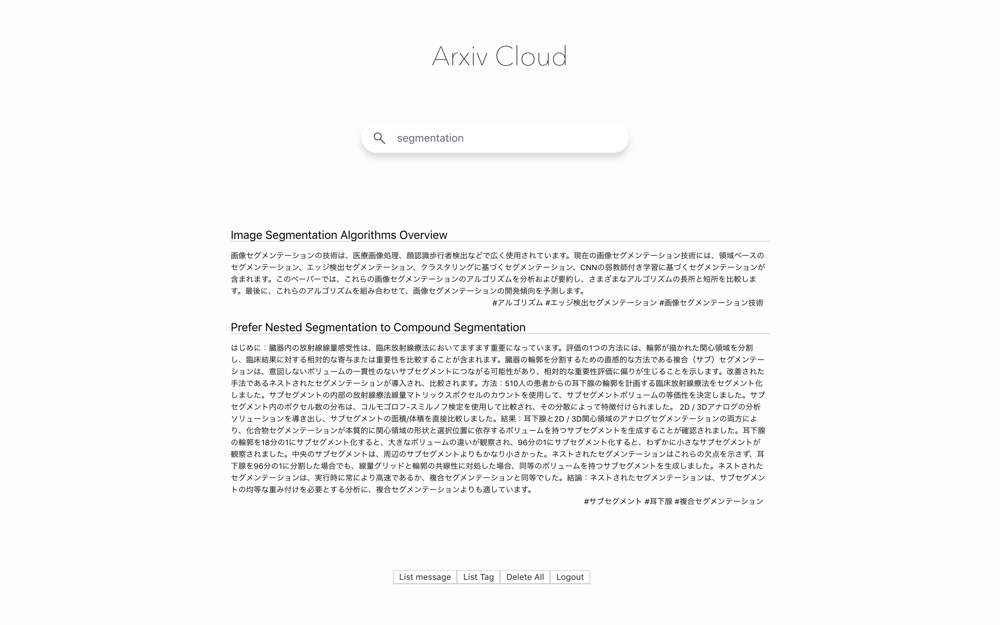
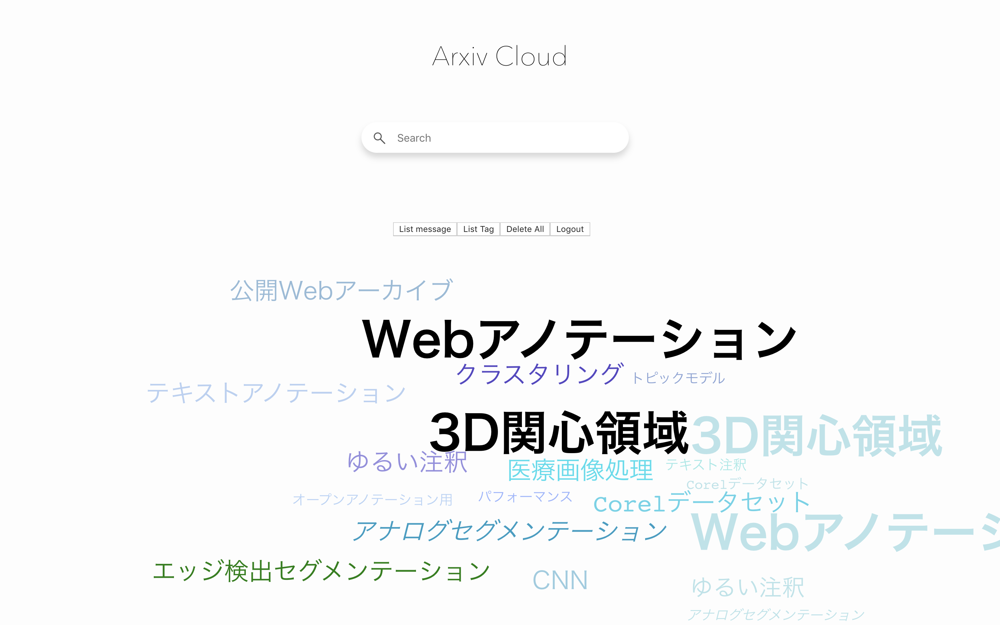

# Arxiv Cloud ☁📄

## 概要

- 日頃の論文サーベイのをより良く、更なる研究を。
- バックエンド Go, フロントエンド React, サーバ MySQL, ユーザ認証 Firebase
- URL: none
- github: here

<div align="center">


</div>

## コア体験

- Arxiv にある論文を検索、自動で和訳した Abstract や抽出されたキーフレーズによるタグを表示し、より高速な論文サーベイ・タグの可視化ができる<br>

- 動機
  - 論文サーベイは時間がかかるが、より高速に様々な論文を読みたい。
  - 日本語で読むほうが早い / 文章のキーワードがあるとより早く判別しやすい
  - 単純なテキスト表示だけでなく、論文の動向の可視化を行いたい

## コア機能

論文検索・和訳表示・タグの可視化(word cloud)

-

1. 論文検索

- [Arxiv API](https://arxiv.org/help/api)
- Get でクエリに検索ワード、検索個数を載せてリクエストを送ると html 形式で返してくる

2. 和訳表示

- [Google Cloud Translation API](https://cloud.google.com/translate/pricing?hl=ja)
- いつもの。V2 だと有料なので、V3beta1 を経由すべき。

3. タグの可視化

- [react-tag-cloud](https://www.npmjs.com/package/react-tag-cloud])のパッケージ
- word cloud を react 経由で使える。preact はダメなので注意を。

## コア機能の設計

### ユーザに関して

| Name         | About                          | Type   |
| :----------- | :----------------------------- | :----- |
| id           | ユーザー ID を保持             | int    |
| firebase_uid | firebase のユーザー ID を保持  | string |
| email        | ユーザーのメールアドレスを保持 | string |
| display_name | ユーザー表示名を保持           | string |
| photo_url    | ユーザー表示画像 URL を保持    | string |
| ctime        | user を作成した時間            | date   |
| utime        | user を更新した時間            | date   |

user

### 論文に関して

#### ツイート内容

| Name  | About                      | Type   |
| :---- | :------------------------- | :----- |
| id    | 論文の id を保持           | int    |
| title | 論文の タイトル(EN) を保持 | string |
| body  | 論文の Abstract(JP) を保持 | text   |
| ctime | article を作成した時間     | date   |
| utime | article を更新した時間     | date   |

article - has many tag

#### タグ内容

| Name       | About                        | Type   |
| :--------- | :--------------------------- | :----- |
| id         | タグの id を保持             | int    |
| article_id | 紐づいている論文の id を保持 | int    |
| tag        | タグの内容(jp) を保持        | string |
| ctime      | tag を作成した時間           | date   |
| utime      | tag を更新した時間           | date   |

tag - belong to article

## URI 設計

| Methods | URI         | About                                               |
| :------ | :---------- | :-------------------------------------------------- |
| GET     | /paper      | ArxivAPI に対し query に keyword を入れて検索       |
| GET     | /articles   | 全ての論文を出す                                    |
| GET     | /tags       | 全ての論文に紐づいたタグをだす(word cloud に投げる) |
| POST    | /delete/:id | 特定の論文を削除、見た目状の変化なし                |

## View 設計

| ページ              | 内容                 |
| :------------------ | :------------------- |
| index.html / App.js | React 経由で全て表示 |

## local 環境

```
❯ docker --version
Docker version 18.09.2, build 6247962

❯ go version
go version go1.12.7 darwin/amd64

❯ node --version
v10.15.3

❯ npm -v
6.4.1
```

### Links

- https://12factor.net
